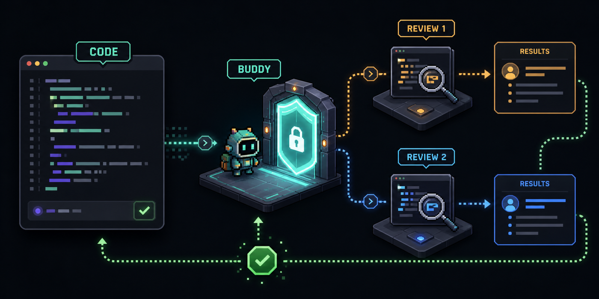
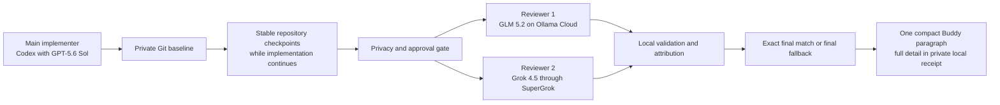
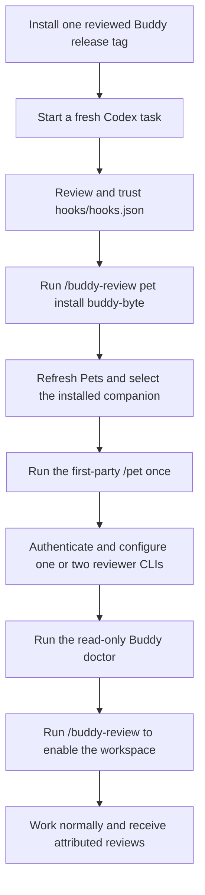
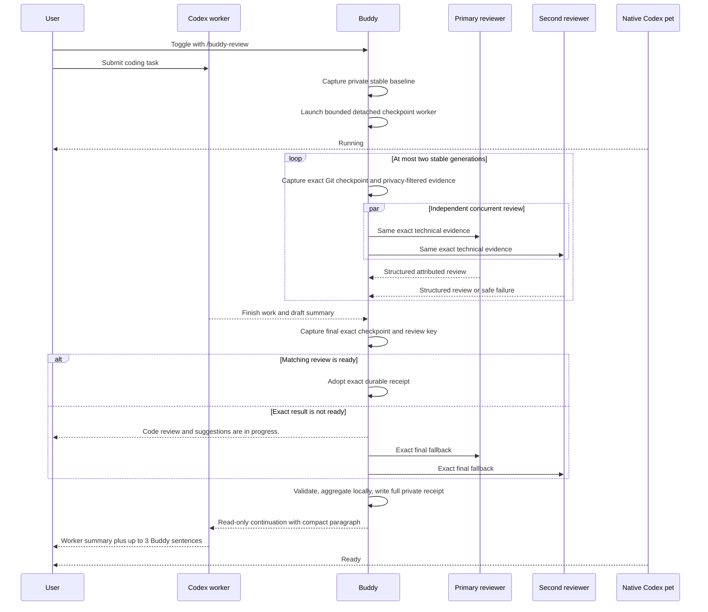

<div align="center">
  <h1>Codex Buddy Reviewer</h1>
  <p><strong>Make use of multiple or barely used AI subscriptions in one place.</strong></p>
  <p>Keep Codex building while one or two independent reviewer connections get ready in the background.</p>
  <p>
    <a href="#quick-start">Quick start</a> ·
    <a href="#connection-support">Connections</a> ·
    <a href="#review-lifecycle">How it works</a> ·
    <a href="docs/PRIVACY.md">Privacy</a> ·
    <a href="#pets">Pets</a> ·
    <a href="#development-and-validation">Development</a> ·
    <a href="CONTRIBUTING.md">Contributing</a>
  </p>
  <p>
    <a href="#status"></a>
    <a href="#quick-start"></a>
    <a href="#connection-support"></a>
    <a href="#pets"></a>
    <a href="#license"></a>
    <a href="#status"></a>
  </p>
</div>



<p align="center"><em>Buddy reviews and reports. It never edits, applies, or merges implementation changes.</em></p>

Keep Codex as the main coding agent, then let one or two separately configured reviewer connections inspect privacy-filtered repository changes while the turn is still running. Buddy validates and attributes their findings, preserves useful disagreement, reports partial failures honestly, and ends with one compact review paragraph beside a persistent animated Codex pet.

> Keep codex and GPT-5.6 Sol as your main implementer, then put an underused secondary subscription, for example: Ollama cloud, Claude, SuperGrok, Opencode, Zai, Kimi Code, etc...with any model (I like GLM 5.2 as my primary reviewer) and even a secondary subscription/agent connection to work as two independent reviewers. The same pattern works with Claude Max, ChatGPT Pro through OpenCode, Kimi through OpenCode, local Ollama, or any supported mix you already have.

Buddy never asks you to paste tokens into its configuration. Authentication remains owned by Claude Code, Grok CLI, Ollama, or OpenCode.

Buddy has no hosted account, central review database, or cross-session reviewer memory. It keeps only bounded local recovery, receipt, and settings state. After an authorized request reaches a reviewer connection, that provider's own service and retention policies apply.

Run the first-party `/pet` command once to keep the selected companion open. `/buddy-review` controls review mode, progress events, and transcript output; it does not launch, select, or wake the native pet.

## Status

Current version: `v0.5.0-rc.1`

This is a release candidate, not a stable release. Provider egress remains experimental until the frozen tree passes the complete security, cross-platform, independent-review, packaging, and Codex host gates below. See the [validation record](docs/VALIDATION.md) for the exact evidence state.

## What Buddy does

- Exposes `buddy-review` in Codex's command menu. Selecting `/buddy-review` with no action toggles automatic review for the current Git workspace.
- Captures a private stable Git baseline, then tracks exact repository checkpoints in a detached worker while the coding turn continues. No screen capture, expanded UI panel, terminal transcript, or display setting is involved.
- Runs one or two configured reviewers concurrently under separate capabilities and per-connection circuit breakers. Continuous mode can pre-review at most two stable generations per turn, then uses an exact final fallback only when the matching result is not already ready.
- Accepts one valid review when the other connection fails, labels the result partial, and never substitutes an unconfigured provider.
- Keeps full reviewer attribution. A deterministic local aggregator can rank duplicate items, but no third model rewrites the two opinions into artificial consensus.
- Validates structured defects, line citations, confidence, and separate optimization, reliability, maintainability, and testing comments before publication.
- Preserves the main agent's final summary in the Codex transcript, then adds one deterministic Buddy paragraph of at most three sentences and 700 characters. Full attributed results remain in the private local receipt and bounded renderer projection.
- Publishes bounded local Buddy lifecycle events for current work, review start, completion, and partial connection state. The main agent summary remains in the Codex transcript and is not copied into new renderer events.
- Provides five public V2 companions, Byte, Mochi, Orbit, Bella, and Lupo, with deterministic atlas validation and transactional installation.
- Uses bounded crash-recovery receipts plus content-free tombstones so an expired or interrupted review can never authorize the same provider call again.
- Shows `Code review and suggestions are in progress.` in the local event stream when the final exact result is not ready yet. A renderer can display that text, while the native pet continues to show only host-owned animation and task state.

## Release gates

An internal sealed whole-repository Deep Security Scan of the pre-fix RC head found 20 findings: 17 medium and 3 low. They clustered around credential syntax gaps, denied-content fragment and live Git metadata coverage, and lossy handling of invalid UTF-8 Git pathnames. Provider-free reproductions proved that affected bytes could enter a prepared external-review prompt or that review evidence could be reported falsely complete.

The release-candidate source implements structural remediations and regression coverage for those finding families, plus independent Grok and Opus review fixes. This is not yet a closure claim. Promotion to stable remains blocked until all release gates close:

1. The exact source head passes the complete local suite, plugin and skill validators, and public-boundary verification.
2. The frozen source passes final RepoPrompt context review, independent Grok 4.5 and Claude Opus 4.8 high reviews, and a fresh sealed whole-repository Codex Deep Security Scan with every reportable finding fixed and revalidated.
3. GitHub Actions passes the Ubuntu, macOS, Windows x64, Node 22, and Node 24 matrix at that same protected default-branch head, then deterministically rebuilds, verifies, re-extracts, and installs the exact artifact.
4. The positive artifact contains a reviewed, hash-pinned Windows x64 Job Object helper whose exact packaged bytes pass real Windows process-tree tests.
5. Windows live provider egress remains disabled until Buddy can create and verify current-user-only DACLs for durable review state and provider temporary roots, with real Windows evidence.

Human artifact-bound host observations for Byte, Mochi, Orbit, Bella, and Lupo are intentionally deferred until real users or pull requests make that adoption-scale process useful. They are not a public RC launch gate. The current protected workflow still reserves them for eventual stable promotion.

The automatic path preserves the main agent's result when Buddy cannot review, and manual review reports a failure instead of inventing an all-clear. Privacy policy, authorization, provider isolation, and result validation are designed to fail closed. The current remediations still require exact-final-tree security and platform revalidation before stable release.

Bella and Lupo are explicitly cleared for public redistribution with Byte, Mochi, and Orbit. Public source history is intentionally rooted at one reviewed commit with GitHub noreply author metadata. The former private development history has a private local backup and is not reachable from the public branch or release tags. Replacing refs in place does not claim that GitHub immediately purged every unreachable or cached private object.

## A practical multi-subscription setup

One common configuration looks like this:

```text
Main coding agent: Codex using ChatGPT Pro
Reviewer 1: Claude Code using Claude Max
Reviewer 2: Grok CLI using Grok 4.5
Result: two concurrent, independently attributed background reviews and one compact final paragraph
```

Another uses the OpenCode connection router:

```text
Main coding agent: Codex
Reviewer 1: OpenCode using OpenAI OAuth and GPT 5.6
Reviewer 2: Ollama using an Ollama Cloud model
Result: exact bounded evidence, two isolated reviewer calls, no hidden fallback
```

The reviewers are peers, not a fallback chain. If both succeed, Buddy preserves both attributed results in the private receipt and may note independent support in the compact paragraph. If one succeeds, Buddy preserves that review, notes the partial result in the compact paragraph, and identifies the failed connection in the private receipt and renderer event. If neither succeeds, Buddy preserves the worker result and reports a degraded review.



Use each connection for the job it is best at:

| Task | Recommended seat | Why |
|---|---|---|
| Main implementation | Codex with GPT-5.6 Sol or your preferred coding model | Keeps the primary task focused on building and validating the change |
| Adversarial correctness review | Grok 4.5, Claude Opus, or another strong independent model | Adds a genuinely different reasoning path after implementation |
| Broad maintainability and optimization review | GLM 5.2 on Ollama Cloud, a GPT model routed through OpenCode, Kimi or Moonshot routed through OpenCode, or local Ollama | Turns spare connection capacity into a second engineering perspective |
| Private or offline review | A capable local Ollama model | Keeps the provider call on the local machine, subject to local model quality |

Provider independence matters more than brand count. Two seats are most useful when they use different model families, different prompts, and separately validated outputs.

## Connection support

| Buddy adapter | Subscription or connection route | Structured output boundary | RC status |
|---|---|---|---|
| `claude` | Claude Code authenticated with Claude Max, Pro, or an Anthropic-supported credential | Claude JSON Schema output plus strict local validation | Implemented in RC |
| `grok` | Grok CLI authenticated with xAI or SuperGrok access | Schema-bound output after a closed isolated configuration preflight | Implemented in RC |
| `ollama` | Local Ollama or Ollama Cloud after normal Ollama sign-in | Full JSON Schema for local models; JSON mode plus strict local validation for `:cloud` models | Implemented in RC |
| `opencode` | OpenCode OAuth or API connections, including OpenAI, xAI, OpenCode Go, Moonshot AI, and other configured providers | Deny-all ephemeral agent, isolated state, JSONL transport rejection on any tool event, strict local validation | Implemented in RC |
| direct Codex CLI | ChatGPT Plus or Pro through Codex CLI | A strict no-tools and no-inherited-instructions boundary is not yet proven | Not enabled |
| direct Kimi CLI | Kimi membership through Kimi CLI | Noninteractive auto-permission behavior is not yet safely disabled | Not enabled |

Authenticate outside Buddy, then confirm the exact model identifier before enabling review:

| Connection | Normal sign-in | Read-only verification |
|---|---|---|
| Claude Code | `claude auth login` through the [official Claude Code flow](https://docs.anthropic.com/en/docs/claude-code/getting-started) | `claude auth status` |
| Grok CLI | `grok login --oauth` through the [official Grok Build flow](https://docs.x.ai/build/overview) | `grok models` |
| Ollama | `ollama signin` through [Ollama Cloud](https://docs.ollama.com/cloud) | `ollama list` and `ollama show <model>` |
| OpenCode | Open OpenCode, use `/connect`, and choose the provider described in the [OpenCode provider guide](https://opencode.ai/docs/providers) | `opencode models [provider]` |

The four implemented adapters can make live reviewer calls on supported POSIX hosts. Windows v0.5 RC blocks all live provider contact before a turn snapshot, review prompt, provider capability, or provider temporary run is created because current-user-only DACL creation and verification is not implemented yet. Read-only status, pet management, configuration, local dry runs, and offline validation remain available on Windows.

ChatGPT Plus or Pro is supported through OpenCode's ChatGPT OAuth connection. SuperGrok can use Buddy's direct Grok CLI adapter or a configured OpenCode xAI connection. Kimi or Moonshot models are supported only when the exact provider/model and API-backed connection are already configured and listed by OpenCode. Ollama Cloud can use Buddy's direct Ollama adapter or a configured OpenCode connection. These routed connections are not native Buddy adapters. Claude Pro or Max must use Buddy's direct `claude` adapter with Claude Code; this project does not route those subscriptions through OpenCode.

Reviewer effort is validated before capability spend or provider dispatch. Claude, Grok, and OpenCode accept `low`, `medium`, `high`, `xhigh`, and `max`. Ollama accepts `low`, `medium`, and `high` only because its adapter maps effort to Ollama's thinking control. Unsupported combinations fail before mode persistence or model contact.

Check the model identifiers visible to your local OpenCode installation before configuring a routed model:

```bash
opencode models
```

OpenCode receives only the authentication entry for the selected underlying provider. Buddy does not forward the rest of the OpenCode auth inventory or unrelated ambient API keys.

## Quick start

Prerequisites:

- Node.js 22 or newer
- Codex with plugin support
- At least one supported reviewer CLI installed and authenticated through its own normal login flow
- Windows v0.5 RC supports nonprovider commands and offline validation, but live reviewer contact is disabled pending current-user-only DACL implementation and real Windows evidence

After the repository and release tag are public, install the reviewed release through Codex's Git marketplace support:

```bash
codex plugin marketplace add pnascimento9596/codex-buddy-reviewer --ref v0.5.0-rc.1
codex plugin add codex-buddy-reviewer@codex-buddy-reviewer --json
codex plugin list
```

The public default branch remains the contributor-friendly source repository. A release version tag is intended to resolve to a separate parentless distribution commit whose tree contains only the byte-verified positive artifact, including its `release-manifest.json`. It does not point at the full development checkout or inherit its objects and history. Install a pinned release tag, never a moving source branch.

The two-command marketplace flow was verified locally with Codex CLI `0.144.4` against this repository layout. The public `v0.5.0-rc.1` tag is created only after the protected release workflow rebuilds, verifies, attests, and publishes the artifact-only release candidate. The stable `v0.5.0` tag remains unavailable until the security, platform, and five-pet Codex host gates close. During private development, use the existing `personal` marketplace flow.



Start a fresh Codex task after installation or upgrade. Review and explicitly trust the changed `hooks/hooks.json` definition when Codex prompts. Then:

1. Type `/buddy-review pet install buddy-byte`, select the Buddy Review skill, and send it. Substitute `buddy-mochi`, `buddy-orbit`, `buddy-bella`, or `buddy-lupo` for another packaged companion.
2. Open Settings, choose Pets, select Refresh, and pick the installed companion.
3. Run the first-party `/pet` command once. Codex persists the open pet, its position, size, and appearance.
4. Install and authenticate the reviewer CLI or CLIs you intend to use through each provider's normal sign-in flow. Buddy does not collect or store those credentials.
5. Type `/buddy-review configure Claude Opus 4.8 as primary and Grok 4.5 as secondary`, adjust the provider and model names to match your connections, select the Buddy Review skill, and send it.
6. Type `/buddy-review run local doctor checks` and review the read-only connection and platform status. A provider health check is separate because it makes a small authorized model call.
7. Type `/buddy-review`, select the Buddy Review skill, and send it to enable automatic review for the current Git workspace. The no-argument toggle otherwise uses Buddy's documented default Ollama Cloud configuration, so configure first unless that is what you want.
8. Work normally. The no-argument `/buddy-review` invocation explicitly authorizes continuous review when it toggles the workspace ON. The native pet shows Codex task animation while Buddy tracks exact Git state and prepares a compact review through the transcript and local event stream.

### Installed command-menu workflow

Marketplace users do not need to locate the plugin directory or run relative Node commands. Select `/buddy-review` in Codex and describe the action after the command:

```text
/buddy-review
/buddy-review pet list
/buddy-review pet install buddy-byte
/buddy-review configure Claude Opus 4.8 as primary and Grok 4.5 as secondary
/buddy-review show status
/buddy-review run local doctor checks
/buddy-review show local data status
/buddy-review disable review and purge this workspace's Buddy content
```

The no-argument form is the one-step workspace toggle. Configuration, diagnostics, pet installation, reversible setup, renderer control, and confirmation-gated purge are all routed through the same skill, which resolves its installed plugin root internally. Any mutating or provider-contacting action still requires the explicit request described in the skill contract.

The raw `node scripts/buddy-review.mjs` examples below are for a full source checkout or for advanced operators already running from the plugin root. They expose the exact underlying commands for auditability, but they are not required for normal marketplace use.

## Configure one or two reviewers

Enable Claude and Grok as a pair:

```bash
node scripts/buddy-review.mjs mode enable \
  --cwd "/path/to/repository" \
  --provider claude \
  --model claude-opus-4-8 \
  --also-provider grok \
  --also-model grok-4.5 \
  --continuous-review
```

Use GPT through OpenCode with Ollama Cloud as the second reviewer:

```bash
node scripts/buddy-review.mjs mode enable \
  --cwd "/path/to/repository" \
  --provider opencode \
  --model openai/gpt-5.6 \
  --also-provider ollama \
  --also-model glm-5.2:cloud \
  --continuous-review
```

Raw mode enable and toggle commands are final-only unless `--continuous-review` is present. That positive flag records purpose-specific consent for privacy-filtered intermediate evidence. Buddy can then send at most two stable speculative generations per turn to each configured reviewer and makes an exact final call only when no matching completed result can be adopted. To select final-only Stop review explicitly:

```bash
node scripts/buddy-review.mjs mode enable \
  --cwd "/path/to/repository" \
  --no-continuous-review
```

Return to one reviewer:

```bash
node scripts/buddy-review.mjs mode enable \
  --cwd "/path/to/repository" \
  --single-reviewer
```

Inspect the exact stored order without contacting a model:

```bash
node scripts/buddy-review.mjs mode status --cwd "/path/to/repository"
node scripts/buddy-review.mjs doctor --cwd "/path/to/repository"
```

An explicit provider health check makes one tiny no-repository-content call per configured reviewer. With two reviewers, it reports `2/2`, `1/2`, or `0/2` and never turns partial health into a full pass.

```bash
node scripts/buddy-review.mjs doctor \
  --cwd "/path/to/repository" \
  --provider-check
```

For a reversible pet plus reviewer setup, create an immutable plan first:

```bash
node scripts/buddy-review.mjs setup plan \
  --cwd "/path/to/repository" \
  --pet-id buddy-byte \
  --provider claude \
  --also-provider grok \
  --continuous-review
```

Review the printed destinations, continuous-review choice, plan ID, digest, and expiry. `setup apply` and `setup rollback` require that exact ID and digest. The plan binds both reviewer destinations and the continuous-review consent state, installs or updates the pet before enabling review, and restores the exact prior review and consent state before the pet during rollback. A fresh or disabled workspace defaults to final-only setup unless `--continuous-review` is explicit; an already-enabled workspace preserves its current choice when neither continuous flag is supplied.

Expired plans that never started are removed opportunistically. Completed apply or rollback journals are eligible for removal after 24 hours. Any partial, malformed, or unresolved transaction is preserved for fail-closed recovery instead of being guessed away.

## The `/buddy-review` and native pet boundary

`buddy-review` is a command-menu skill, not a third-party registration of a native first-party slash command. Codex plugins cannot currently select, wake, move, or force arbitrary animations in the native pet window, and cannot insert arbitrary plugin speech bubbles into it.

The supported composition is still useful:

- Codex owns the persistent native sprite, built-in animations, Running and Ready task state, unread completion, position, and size.
- Buddy owns repository checkpointing, the review lifecycle, progress events, attributed findings, optimization comments, private receipts, and the compact transcript continuation.

This project does not patch app bundles, private Electron IPC, generated vendor files, or system application resources.

The former Claude Code `/buddy` was a short-lived April 1 to April 8, 2026 terminal reaction feature, not a continuous code reviewer. See the [clean-room behavior research](https://github.com/pnascimento9596/codex-buddy-reviewer/blob/main/docs/ORIGINAL-CLAUDE-BUDDY-RESEARCH.md) for primary artifact links, the corrected timeline, and the design differences.

## Review lifecycle



Buddy's snapshot is a private Git repository checkpoint, not a screenshot. A full checkpoint digest provides freshness identity; reviewers receive the bounded privacy-filtered diff and grounding evidence, not pixels, terminal panes, hidden UI state, or collapsed activity entries. The baseline-to-final delta represents changes captured during the observed turn window, subject to the documented RC completeness limits. It cannot prove exclusive authorship if a human, formatter, generator, or another process edits the same worktree concurrently.

Every configured reviewer sees the same exact technical evidence and runs independently. Their full structured findings, attribution, disagreements, connection failures, and optimization comments stay in the local private receipt. The visible Buddy review is deterministically reduced to one paragraph with at most three sentences and 700 characters, prioritizing the highest-value defect, recommendation, optimization, partial-review warning, or defensible no-finding result.

## Worker-summary advisory

The worker summary stays local by default. Enabling the advisory requires separate consent bound to the primary reviewer and its exact model:

```bash
node scripts/buddy-review.mjs summary-guard enable \
  --cwd "/path/to/repository" \
  --confirm-summary-egress
```

When two reviewers are configured, only the primary can receive that separately screened packet. The second reviewer remains technical-only. Changing the primary connection makes stale consent fail closed. Because the summary does not exist until Stop, enabling this guard disables speculative background review for that turn. Buddy performs the ordinary exact Stop review instead, so the summary advisory and technical result stay bound to the same final request.

The packet is terminal-sanitized, capped at 4,000 characters, screened for high-confidence secrets and excluded-path references, and bound to the review key and consent revision. Its returned advisory is structurally separate and cannot become a severity, path, line citation, impact, or technical finding.

## What leaves the machine

When the current RC checks authorize a request, each reviewer receives:

- the bounded, locally screened patch evidence;
- allowlisted relative path names and changed-line metadata;
- the aggregate patch hash;
- generic exclusion, truncation, and incompleteness counts.

With continuous mode enabled, this can happen for up to two stable intermediate generations per turn and one exact final fallback per configured reviewer. The final fallback is skipped when an exact matching completed receipt is ready. Enabling continuous mode is therefore an explicit additional egress and subscription-usage choice.

The design does not intentionally include:

- the original user prompt;
- the worker's final summary;
- excluded path names or contents;
- raw provider stderr;
- Codex transcripts, credentials, memory, tools, subagents, or direct repository access.

Buddy does not create a persistent reviewer chat and does not carry model conversation state from one coding turn to the next. It never derives evidence from what happens to be visible on screen.

The privacy kernel blocks common credential paths and formats, scans otherwise allowed text for high-confidence secrets, and detects exact or bounded normalized fragments copied from registered denied endpoints and live Git metadata. Namespaced secret keys, Bearer and Basic authorization values, connection credentials, wrapped and short denied fragments, and registered live sources have focused regression coverage. Invalid UTF-8 Git pathnames fail closed before provider approval. It is conservative endpoint protection, not universal semantic DLP or file-event history. Short or low-entropy secrets, unknown generic formats, nested encodings, YAML block scalars, XML, archives, and uncommon assignment syntaxes are not exhaustively classified. Decoded transformations and files created and removed entirely between captures may be unavailable.

These are intended boundaries, not a final release claim. The remediated exact tree still requires a fresh sealed scan before provider egress is promoted from experimental.

## Pets

| Pet | Character | Artifact scope |
|---|---|---|
| Byte | Curious robot engineer with crisp technical gestures | Public |
| Mochi | Warm cat-like reviewer with expressive waiting and review poses | Public |
| Orbit | Small floating alien with readable directional movement | Public |
| Bella | Cheerful tan-and-white dog companion | Public |
| Lupo | Cheerful white speckled dog companion | Public |

```bash
node scripts/buddy-review.mjs pet list
node scripts/buddy-review.mjs pet install buddy-byte
node scripts/buddy-review.mjs pet install buddy-mochi
node scripts/buddy-review.mjs pet install buddy-orbit
node scripts/buddy-review.mjs pet install buddy-bella
node scripts/buddy-review.mjs pet install buddy-lupo
```

The installer is exact-byte hash-pinned, idempotent, symlink-resistant, and limited to catalog-defined `buddy-*` IDs. Remove creates a recoverable owned backup, and restore verifies its hashes before moving it back.

The positive public artifact is the output of the release builder after allowlist, hash, protocol, and package verification. It contains all five pets. Bella and Lupo received explicit owner authorization for public redistribution on 2026-07-19, recorded in their provenance files.

The public source branch and installable artifact are separate trust boundaries. The source branch begins at a reviewed parentless commit with noreply author metadata and passes complete-history secret, path, privacy, and publication scans. Release tags resolve to separately constructed artifact-only commits whose bytes must match the verified positive artifact.

## Manual one-shot review

The manual path defaults to Grok:

```bash
node scripts/buddy-review.mjs review --cwd "/path/to/repository"
```

Choose any supported adapter:

```bash
node scripts/buddy-review.mjs review \
  --cwd "/path/to/repository" \
  --provider claude \
  --model claude-opus-4-8
```

Inspect evidence metadata without model egress or a receipt:

```bash
node scripts/buddy-review.mjs review \
  --cwd "/path/to/repository" \
  --dry-run
```

Manual receipt storage is off by default. Add `--store` only when you deliberately want a bounded local receipt, and add `--retain-evidence` only together with `--store`. The older `--no-store` flag remains as an explicit compatibility spelling. Manual review uses one connection per command. Automatic mode is the bounded one-or-two reviewer workflow.

## Receipts and local events

Workspace review consent is stored outside the repository:

```text
~/.codex/codex-buddy-reviewer/mode/<workspace-hash>.json
```

Hook runtime state uses Codex's private `PLUGIN_DATA` directory when available. Automatic content-bearing receipts support crash-safe continuation replay. Unobserved content becomes eligible for removal 24 hours after completion, observed content becomes eligible 24 hours after the recorded presentation observation, and orphaned receipts use bounded file age. Content-free turn tombstones retain only the identifiers, timestamps, terminal state, and digests needed to prevent a provider rerun. Manual reviews create no receipt unless `--store` is explicit. Because Buddy is not a daemon, age-based hard expiry occurs during an eligible lifecycle prune. Acknowledgment-based early deletion requires explicit `renderer prune --apply`; workspace purge is the immediate cleanup path once its safety prerequisites pass.

If a provider returns a valid review but Buddy cannot remove its disposable temporary state, the review is preserved and a bounded `temporary_state_cleanup_failed` operational warning is emitted. Raw cleanup paths, errors, and causes are never published. A provider or preflight failure remains authoritative if cleanup also fails.

Renderer events are immutable, sequenced, and locally stored. New v2 events store `worker_summary: null`; a retained legacy v1 event can contain a summary, but the renderer projection hides it unless the operator explicitly requests the legacy compatibility field. The progress detail is exactly `Code review and suggestions are in progress.` and the completed detail uses the same compact paragraph as the transcript. Full structured reviewer results remain in the private receipt and bounded event projection during their retention window. Acknowledgment can shorten retention and cannot extend the 24-hour age limit. Hard expiry runs during an eligible lifecycle prune. Early acknowledgment-based deletion requires explicit `renderer prune --apply`, and workspace purge removes review content immediately after its fail-closed preconditions pass:

```bash
node scripts/buddy-review.mjs data status --cwd "/path/to/repository"
node scripts/buddy-review.mjs mode disable --cwd "/path/to/repository"
node scripts/buddy-review.mjs data purge --cwd "/path/to/repository" --confirm-purge
```

Purge preserves connection, pet, and mode settings unless `--include-settings` is explicit. It refuses while automatic review is enabled or a provider capability is live. Provider-side service retention remains governed by the selected connection. See [docs/PRIVACY.md](docs/PRIVACY.md) and [docs/PET-RENDERER-PROTOCOL.md](docs/PET-RENDERER-PROTOCOL.md).

## Security and operational limits

- Reviewer CLIs are trusted local executables. Tool denial and isolated state reduce capability; they are not an operating-system sandbox.
- On POSIX, the supervisor owns one provider process group, observes leader exit independently of inherited pipe EOF, kills remaining in-group descendants once, and drains bounded output. A malicious binary can deliberately escape into another session or process group.
- On Windows, v0.5 RC blocks live reviewer contact before evidence or prompt persistence because durable Buddy state and provider temporary roots do not yet have verified current-user-only DACLs. The native Job Object helper and its host-independent tests remain process-containment work for a later enabled Windows path; they do not override this privacy gate.
- Capability issuance is atomic for the full reviewer set. Capabilities are short-lived, single-use, exact-bound, and positively settled before a completed configuration revocation returns.
- Delivery is durably tracked through prepared, claimed, stdout-written, and observed states. Without a host acknowledgment token, a crash after stdout becomes visible but before observation can still make a later replay duplicate the continuation.
- Credential values never belong in source, fixtures, docs, prompt exports, receipts, logs, Git history, or release artifacts. CI scans complete committed history, and the release candidate is also scanned as a built directory.
- Default tests and CI never consume a paid model subscription. Live checks are explicit and bounded.

Read [docs/SECURITY.md](docs/SECURITY.md), [docs/ARCHITECTURE.md](docs/ARCHITECTURE.md), and [docs/AUTOMATIC-MODE.md](docs/AUTOMATIC-MODE.md) for the full contracts.

## Why JavaScript, and where other languages fit

Buddy stays on modern Node.js ESM because Codex hooks already execute Node, the product is mostly asynchronous CLI and filesystem orchestration, and the release can ship directly executable source with zero runtime dependencies. A small native C Windows Job Object helper is intentionally confined to the operating-system process-containment boundary.

The recommended next language step is strict checked JavaScript in v0.6: pinned development-only TypeScript tooling, `checkJs`, JSDoc contract types, and no emitted build tree. That targets the real risk areas, including provider approval, capability states, privacy coverage, persisted migrations, and review schemas, without adding a compiler to the current release boundary.

Python would add a second required runtime without improving the host or security model. Rust is a reasonable future candidate only for a narrow Windows ACL or process-isolation broker, or a protocol-compatible replacement of the current C helper, after real platform evidence shows that a migration is justified. See [the language strategy](docs/ARCHITECTURE.md#language-strategy) for the staged decision.

## Development and validation

```bash
npm run validate
npm run security:secrets
npm run security:publication
npm run release:build -- --output /tmp/codex-buddy-public-rc1
npm run release:verify -- --input /tmp/codex-buddy-public-rc1
npm run release:distribution -- \
  --artifact /tmp/codex-buddy-public-rc1 \
  --output /tmp/codex-buddy-v0.5.0-rc.1-distribution \
  --policy-root .
```

These development commands require the complete source checkout, not the trimmed runtime artifact. The build destination must not already exist, must be outside the source repository, and is never overwritten.
`security:publication` is the release-only complete-history privacy gate. It requires a clean, non-shallow publication candidate and is deliberately excluded from ordinary dirty-tree `npm run validate` work. GitHub noreply identities and reserved `.invalid` fixture addresses are accepted by default. A reviewed public contributor address requires an explicit `--allow-email` argument.
The protected `public-release` environment can store one such reviewed address as the `PUBLICATION_ALLOWED_EMAIL` environment secret. The manual release workflow passes it to the scanner without committing it to source. When the setting is absent, the strict default scan still runs, so a sanitized fork does not need repository-specific configuration and a repository that still requires an allowlist fails closed.
The builder materializes public inputs from committed `HEAD` blobs, so clean or smudge filters and line-ending conversion cannot change the artifact bytes. It also refuses to build when a selected source path is modified, staged, untracked, or ignored, and an explicit `--source-commit` must equal the repository's current `HEAD`. Verification derives its expected path set and every expected byte from the trusted full source checkout at that same commit rather than trusting the artifact-authored manifest as policy. The development-only `release:boundary` check validates an isolated committed snapshot so a dirty working tree can still run structural tests; that synthetic artifact is not a release candidate.

`release:distribution` re-verifies that positive artifact, rejects bounded credential-shaped material and personal filesystem paths, and creates a new local Git repository with one parentless commit and one annotated `v<version>` tag. The commit tree is byte-identical to the artifact. Committer, author, and tagger identities are fixed to a public release bot; timestamps derive deterministically from the bound source commit; the object database contains no inherited or unreachable objects; and the repository has no remote. The command does not publish, push, change visibility, or tag the source checkout.

The GitHub release workflow is manual-only and always starts from the protected public source branch. It rebuilds and verifies the positive artifact, creates the parentless distribution tag in an isolated repository, and uploads the deterministic tarball, checksums, Git bundle, and path-free distribution receipt as one candidate. The default `publish: false` path makes no repository mutation. An RC run with `publish: true` creates an attested GitHub prerelease without claiming host acceptance. A final-version publication additionally requires the protected release environment and complete host evidence. Before either publication, a dedicated least-privilege job attests the tarball, distribution bundle, and receipt; the publication job verifies those attestations and the unchanged protected source head before pushing the artifact-only tag and creating the matching release. A rerun accepts an existing tag or release only when its object IDs, metadata, asset names, and asset bytes exactly match the verified candidate.

Focused validators are also available:

```bash
node scripts/buddy-eval.mjs validate --json
node scripts/validate-pet-atlases.mjs --json
python3 ~/.codex/skills/.system/skill-creator/scripts/quick_validate.py skills/review
python3 ~/.codex/skills/.system/skill-creator/scripts/quick_validate.py skills/buddy-review
python3 ~/.codex/skills/.system/plugin-creator/scripts/validate_plugin.py .
```

The generated positive artifact must pass the release-boundary verifier before installation or publication. See [docs/VALIDATION.md](docs/VALIDATION.md), [docs/HOST-E2E-RUNBOOK.md](docs/HOST-E2E-RUNBOOK.md), and [docs/PETS.md](docs/PETS.md).

Contributions are welcome. Read [CONTRIBUTING.md](CONTRIBUTING.md) before opening a pull request. GitHub private vulnerability reporting is enabled as part of the public visibility transition and is the required channel for any sensitive security or privacy issue.

## License

The code, positive public artifact, and all five pet packages are Apache-2.0. Bella and Lupo have explicit owner authorization for public redistribution. See [LICENSE](LICENSE), [NOTICE](NOTICE), [docs/PRIVACY.md](docs/PRIVACY.md), and [docs/PROVENANCE.md](docs/PROVENANCE.md).
