# Architecture

## Product stance

Buddy is a review kernel plus a Codex lifecycle adapter. Codex's native pet is the default renderer because it already supplies a persistent animated overlay, task status, unread completion, navigation, positioning, and custom sprite support. A renderer-neutral outbox keeps richer bubbles or drill-down feasible without coupling evidence collection to private desktop IPC.

## Language strategy

Node.js ESM remains the product runtime. Codex hooks already execute `node`, the provider adapters are asynchronous CLI and filesystem integrations, tests use `node:test`, and the positive release artifact materializes and hashes directly executable committed source blobs. Adding Python would impose a second runtime without improving the host contract, process boundary, or privacy model.

GitHub currently reports the default branch as 100 percent JavaScript because that pushed tree predates the native Windows helper. The hardening branch contains a small C boundary in `native/windows/job-supervisor.c` plus native test probes. The repository is therefore predominantly JavaScript, not literally JavaScript-only.

The recommended typing path is incremental checked JavaScript, not a release-blocking rewrite:

1. Keep `.mjs` as the shipped v0.5 source and preserve zero runtime dependencies.
2. In v0.6, pin TypeScript and Node type definitions as development-only dependencies with a lockfile.
3. Enable `allowJs`, `checkJs`, `noEmit`, `strict`, `noUncheckedIndexedAccess`, and `exactOptionalPropertyTypes`.
4. Add JSDoc contracts first around approved provider requests, egress capabilities, privacy coverage, review schemas, persisted state migrations, and provider results.
5. Expand checking module by module without weakening runtime exact-key validation or introducing broad `any` escape hatches.
6. Move authored source to `.ts` only if checked JavaScript proves insufficient and the resulting build, source-map, and release-provenance complexity is justified by measured maintenance value.

Rust is a future option only for a protocol-compatible replacement of the narrow Windows Job Object helper or a similarly narrow OS isolation broker. Any replacement must pass the same differential protocol, process-tree, architecture, reproducible-build, binary provenance, and release-manifest gates before cutover. The privacy kernel, lifecycle, provider adapters, persistence, and pet system should remain in Node. Python is reserved for separate research or analysis tools only if a concrete need appears.

Module decomposition is more urgent than adding a language. The largest modules should be split along existing pure validation, state-transition, storage, and orchestration seams after v0.5 behavior is frozen. This reduces blast radius while preserving the current runtime and security contracts.

## Automatic v0.5 path

```mermaid
flowchart LR
    U["User enables workspace mode"] --> S["UserPromptSubmit"]
    S --> B["Budgeted stable private baseline tree"]
    B --> W["Codex worker turn"]
    W --> T["Stop plus final worker summary"]
    T --> L["Turn lock and durable-state recovery"]
    L --> F["Budgeted stable private final tree"]
    F --> D["Shared privacy kernel and observed delta"]
    D --> K["Deterministic review key and durable attempt"]
    K --> X{"Short mode and summary authorization"}
    X -->|closed| G["Atomic batch of one or two exact-bound egress capabilities"]
    G --> R["Ordered reviewers run concurrently outside configuration locks"]
    X -->|open| E["Fail-open degraded event"]
    R --> V["Strict validation per reviewer"]
    V --> J["Deterministic attributed aggregation"]
    J --> P["Write-once terminal receipt with reviewer runs"]
    P --> O["Sequenced immutable pet event"]
    P --> A["Separate companion presentation and XP"]
    P --> C["Single Stop continuation"]
    C --> Q["Combined worker summary and Buddy addendum"]
```



## Snapshot contract

Each enabled root turn gets a private snapshot directory under `PLUGIN_DATA`. Capture:

1. resolves the canonical Git root;
2. creates a private Git index and object directory;
3. uses the repository object directory only as a read-only alternate;
4. initializes from the current `HEAD`, or an empty tree in an unborn repository;
5. overlays staged, unstaged, and safe untracked worktree content;
6. hashes blobs with `git hash-object --no-filters`, preventing repository clean filters from executing;
7. fingerprints denied content locally but never puts it in the review tree;
8. writes a tree and repeats the entire capture;
9. aborts unless the two signatures, status, and `HEAD` agree.

The Stop path captures a final tree in the same private object store and diffs the two trees. This survives a `HEAD` commit during the turn and excludes unchanged pre-existing dirty content. It does not establish exclusive actor provenance in a concurrently edited worktree.

## Deterministic identity and state machine

The review key is a SHA-256 of canonical JSON containing:

```text
session_id
turn_id
canonical repository root
baseline tree hash
final tree hash
hash(last_assistant_message)
ordered primary and optional secondary provider/model/effort descriptors
prompt, policy, and result-schema versions
confidence threshold
patch budget
summary-claim guard enabled state, policy, consent revision, provider, and model
```

State is:

```text
no receipt
  -> unique-claim turn lock
  -> recover receipt or compute bounded evidence
  -> mode-locked authorization and per-reviewer circuit checks
  -> publish durable attempt marker immediately before provider-capable calls
  -> atomically issue one capability per executable configured reviewer
  -> run one or two ordered reviewer lanes concurrently, with no retries or fallback
  -> validate each lane independently and aggregate without a synthesis model
  -> atomically published write-once terminal receipt
       findings | no_findings | abstain
       provider_unavailable | circuit_open | staged local failure
  -> continuation prepared
  -> random-token delivery claim
  -> stdout write callback completed
  -> continuation observed by stop_hook_active
```

The turn lock spans the full Stop lifecycle, and UserPromptSubmit baseline publication uses that same lease, so a late Start cannot publish after Stop terminalizes the turn. A provider-lane lease serializes provider-capable turns without making the mode file itself the long-running mutex. Under short mode and, when applicable, summary-consent locks, Buddy checks the exact revision and each configured reviewer circuit, writes one attempt fence, and atomically issues one durable single-use egress capability for every executable reviewer lane. Batch issuance either publishes every lane capability or publishes none. Each capability independently binds the workspace/session/turn/review identities; its provider/model/effort/timeout and configuration digest; exact prompt bytes and digest; response-schema digest; optional summary-consent revision and packet digest; and bounded issue/spend/execution deadlines. The locks are then released before the capabilities are durably consumed and the reviewers start concurrently.

Mode or summary-consent mutation commits its new revision while holding its short lock, snapshots capabilities authorized by the prior revision, releases the lock, and drains only those exact capabilities. The command returns only after positive settlement; elapsed deadlines or a dead owner process do not manufacture a successful drain. This is intentionally availability-conservative after an ambiguous crash. A surviving attempt marker still prevents provider replay, and a surviving unresolved capability can make a later mutation time out until a positive supervisor/recovery protocol exists. Three consecutive real failures open a workspace/provider+model circuit for 30 minutes; each reviewer has its own circuit, and an open circuit never redirects work to another connection. Only actual executor entry affects a circuit, while local evidence/persistence failures and no-change turns do not.

One successful lane is sufficient to publish a partial dual-reviewer result. The failed or open lane stays attributed in `reviewer_runs`, and Buddy never invents a replacement reviewer. If neither configured lane succeeds, Buddy preserves the worker result and publishes a degraded terminal state. Successful results are combined locally and deterministically: findings and comments keep source receipts, duplicates use grounded identity keys, ordering is risk-first with stable source order, and no third model synthesizes the output. The Stop continuation is issued after the terminal receipt is durable. Delivery moves `prepared -> claimed(token, lease) -> stdout_written -> observed`; a live claim suppresses duplicates, while a later retry reconstructs the continuation from the receipt without rerunning a provider. The stdout callback proves only that the hook process wrote its response, not that the host consumed it. Outbox publication is bounded, immutable, sequenced, attributed, and best-effort.

## Capture budgets, TTL, and privacy fragments

Manual and automatic capture use the same Git/privacy primitives. An aggregate monotonic budget spans both stability passes and bounds elapsed time, paths, file bytes, Git input/output, Git operations, and private object bytes. A budget failure terminalizes the lifecycle before provider launch.

Abandoned turn state is opportunistically pruned after a 24-hour TTL. For each candidate, the pruner nonblockingly acquires the exact per-turn Stop lease, reconciles a stale dead claim through the shared lease primitive, and performs liveness checks plus mutation while holding that lease. A live Stop lease therefore excludes pruning. A stale attempt is first terminalized as `prior_attempt_incomplete`; a stale baseline becomes `baseline_expired`. Only after terminalization are snapshot objects removed, so pruning never re-authorizes a provider attempt.

Denied endpoints contribute exact digests and salted normalized fragments. Long inputs use bounded content-defined fragments. Denied inputs of at most 32 normalized bytes use one exact length-bound HMAC; inputs from 33 through 127 bytes use alignment-independent 32-byte HMAC windows checked against bounded candidate windows. Window entries retain a 128-bit HMAC prefix so the bounded local inventory can cover ordinary configuration files without retaining plaintext. Collisions fail safe by excluding extra candidate content. Both inventories and the candidate-window work are capped and fail closed when completeness cannot be established. Matching normalizes NFC and whitespace, detecting exact small values and substantial contiguous copies from short records despite whitespace/CRLF changes. Extracts shorter than 32 bytes from a longer short record are a deliberate false-positive/coverage tradeoff, not semantic decoding or file-event history.

Allowed-looking text is also scanned locally for a bounded set of high-confidence private-key/token formats and high-entropy values assigned to secret-like names. The scan is capped at 2 MiB and fails closed on oversized or invalid UTF-8 candidates. This materially narrows accidental secret egress but does not claim semantic decoding, transform tracking, or recovery of content created and deleted entirely between the two endpoint captures.

Deleted files remain reviewable when their old bytes are complete, bounded, text-safe, and privacy-safe. Their hunk ranges carry `side: old`; result schema v2 requires `line_side: old` for grounded deleted-file citations. Legacy v1 results remain locally readable but normalize to v2.

## Failure behavior

- Disabled mode, nested agent, non-review continuation: silent no-op.
- Missing baseline: explicit abstention; never fall back to the whole worktree.
- Unstable snapshot: fail-open system message; no egress.
- Excluded or incomplete evidence: validator prevents clean assurance.
- One of two reviewers fails, times out, returns invalid output, or has an open circuit: publish the successful lane as an attributed partial result; do not retry or substitute a provider.
- Every configured reviewer fails or is unavailable: terminal degraded receipt and event; worker result remains intact.
- Duplicate Stop: no new provider call; a fresh tokenized delivery claim is suppressed, stale/unattempted delivery is replayed from the durable receipt, and `stop_hook_active` records observation under the same turn lock.

Provider lifecycle containment is platform-specific. POSIX execution owns one supervised process group and reports normal success only after remaining in-group descendants are terminated; the provider leader reports its authenticated exit independently of inherited stdout/stderr handles so an ordinary descendant cannot hold success open until the deadline. A child that deliberately creates a new session/process group is outside that boundary. Windows provider calls require the verified native Job Object helper and never fall back to direct spawn. Raw control records must be printable ASCII, and `EXIT`, `ERROR`, or `TERMINATED` must agree with the helper process's actual close status. The pipe token correlates the protocol but is not a hostile same-account identity proof, and pre-spawn helper hashing is not an execution-stable defense against a same-account file replacement. Neither mechanism is presented as a filesystem, network, credential, or malicious-binary sandbox.

## Renderer boundary

Plugin-native responsibilities:

- consent and mode state;
- exact turn-window snapshotting;
- independent review and validation;
- attributed reviewer receipts, per-reviewer circuits, and event outbox;
- one audited transcript continuation.

The optional summary-claim advisory has its own purpose-specific consent, primary provider/model binding, consent revision, bounded sanitized packet, and exact UTF-16 offsets. Even when two reviewers are configured, only the ordered primary can receive this separately consented packet; the secondary always receives technical evidence only. Before issuance, Buddy assesses the exact transmitted packet with the bounded secret scanner, exact excluded-path references, and high-risk path policy; an unsafe or incomplete assessment issues technical-only capabilities instead. The short summary-consent lock is held only through exact packet construction and atomic capability issuance; revocation drains every non-null summary capability at or below the revoked revision before its command returns. The returned advisory is validated independently. Invalid advisory output becomes advisory abstention without invalidating an otherwise valid technical envelope. Advisory fields cannot express a code severity, path, line, impact, or finding, so they cannot be promoted into the technical channel. Since both outputs come from one inference, this is a structural and validation guarantee rather than a claim that the optional summary packet can never influence the model's technical output or that its local preflight is universal semantic DLP.

## Reviewer adapter boundary

The registry exposes four adapter IDs: `claude`, `grok`, `ollama`, and `opencode`. A mode contains one ordered primary descriptor and at most one ordered secondary descriptor. The same exact evidence request is prepared for both lanes except for the optional primary-only summary packet. Adapter selection is explicit and never falls back.

- `claude` invokes the authenticated Claude Code CLI directly with safe mode, a static reviewer-only system prompt that replaces dynamic per-machine default sections, no tools, no MCP configuration, no session persistence, an explicit response schema, and a disposable working directory. This is the supported route for a Claude Max subscription. Authentication and administrator-managed Claude policy remain external boundaries.
- `grok` invokes the authenticated Grok CLI directly through its existing isolated bridge.
- `ollama` invokes Ollama directly for either local models or Ollama Cloud models. The process runs from a private Buddy-owned, workspace-attributed temporary directory instead of the reviewed repository, preventing ordinary cwd-based project configuration discovery. Existing allowlisted home-profile and `OLLAMA_HOST` inputs are preserved so Ollama authentication and connection behavior do not change. This boundary is not a filesystem, credential, process, or network sandbox. Local models receive the response schema through Ollama structured output. Cloud models use JSON transport followed by the same strict local result validation because Ollama Cloud does not accept the full schema transport.
- `opencode` invokes a pure, disposable, deny-all OpenCode agent. The model must use `provider/model` form. Buddy projects only that selected provider entry from the OpenCode auth store into the disposable environment, disables external skills, project configuration, plugins, MCP, sharing, tools, and ambient provider credentials, and then validates the returned JSON locally. This is the supported route for ChatGPT Pro through OpenCode OpenAI OAuth and for a Kimi model exposed by a configured OpenCode provider connection.

Direct Codex CLI and direct Kimi CLI adapters are intentionally unsupported. They remain outside the registry until each can prove strict no-tools and no-inherited-context execution while preserving the intended subscription authentication. Buddy does not extract subscription credentials or forward the full OpenCode auth inventory.

## Artifact-only release tag boundary

The public source branch and the installable release tag have intentionally different histories. The source branch stays contributor-friendly and retains normal reviewable development history. A release tag is prepared in a separate local repository and resolves to one parentless commit whose complete tree is the already verified positive artifact. The artifact's own `release-manifest.json` remains inside that tree. No tests, private development paths, source-only release tooling, ancestor commits, remotes, or inherited Git objects are added.

Construction uses Git plumbing with filters disabled. Every artifact file becomes a mode-`100644` blob from its exact bytes, the generated tree is committed without a parent, and a deterministic annotated `v<version>` tag points to that commit. Author, committer, and tagger use the fixed public release-bot identity. Their UTC timestamp is the bound source commit's epoch, so the same source commit and artifact reproduce the same tree, commit, and tag object IDs regardless of ambient Git identity or output path.

Verification re-derives artifact policy from the trusted source `HEAD`, reruns bounded credential and personal-path checks, compares every Git blob and worktree file with the artifact bytes, requires a clean worktree, peels the annotated tag to the only commit, and inventories the complete object database. Any extra ref, parent, remote, local identity setting, unexpected configuration, unreachable object, inherited object, changed byte, or mismatched tag metadata fails the candidate. This creates a local tag candidate only. Publication and remote mutation remain a separate explicitly authorized release operation.

## Guided setup state machine

Setup is a private immutable journal, not a best-effort command sequence:

```text
plan -> apply intent -> pet applied -> mode applied -> applied
                                      |
                                      v
rollback intent -> mode restored -> pet restored -> rolled back
```

The plan binds the canonical workspace/Codex home, plugin version, exact pet hashes and backup inventory, mode revision, desired state, expiry, and a SHA-256 digest. Expiry is enforced before the first apply intent; once intent exists, a retry may recover after expiry so it does not strand an approved partial mutation. Pet transactions are reconciled before classifying a retry. Every state must be exactly the approved before state, approved after state, or one recognized update-rollback midpoint. Mode writes use expected revisions under the mode lock. Rollback validates both subsystems before its first mutation, restores mode first, and preserves removed pet packages as hash-owned backups. Expired never-started plans and terminal applied or rolled-back journals older than 24 hours are removed through bounded, lock-protected, ownership-checked quarantine. Partial, malformed, and unresolved state is preserved. Private JSON publication syncs file contents and its parent directory on POSIX. This improves rename durability but does not provide a universal power-loss guarantee on every platform or immunity to an adversarial same-user ancestor swap between filesystem checks.

Presentation state is separate from review mode. Pet/profile changes therefore do not change the review configuration revision or review identity. Personality/mood utterances are static deterministic strings. XP is a write-once credit per unique durable completed review key, with equal credit for findings, no-findings, and defensible abstention; provider or lifecycle failures receive none.

Renderer outbox v2 assigns a workspace-monotonic sequence outside the deterministic event ID. Consumers explicitly register, pull, acknowledge an opaque cursor, and unregister. Delivery is at-least-once. New events never persist worker summaries. Acknowledgment can shorten retention, but no consumer can extend the 24-hour content age threshold. Aged v1 events are removed with lock-protected migration-index compaction, while the producer high-water mark prevents sequence reuse. Cleanup is opportunistic because Buddy has no background daemon.

Native Codex host responsibilities:

- persistent sprite window and fixed animation states;
- pet selection, size, position, and wake/tuck behavior;
- command-menu rendering of enabled skills;
- task activity and unread completion.

Deferred optional sidecar responsibilities, subject to the v0.5 decision record:

- arbitrary speech bubbles;
- event cursor/ack and offline replay;
- finding drill-down;
- reviewer-specific animation states beyond Codex's fixed pet contract.

No app bundle patching, private Electron IPC, or Codex configuration mutation is part of this design.
